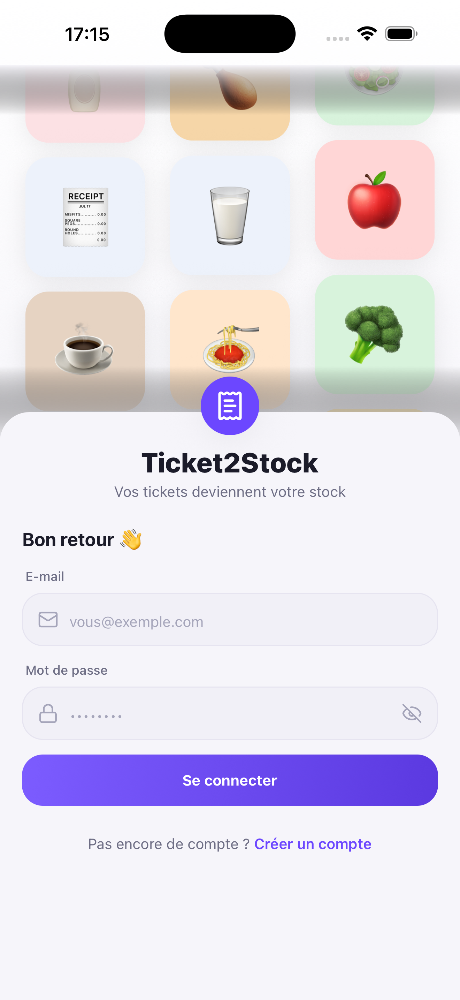
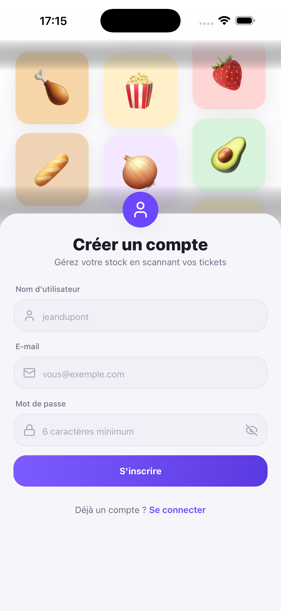
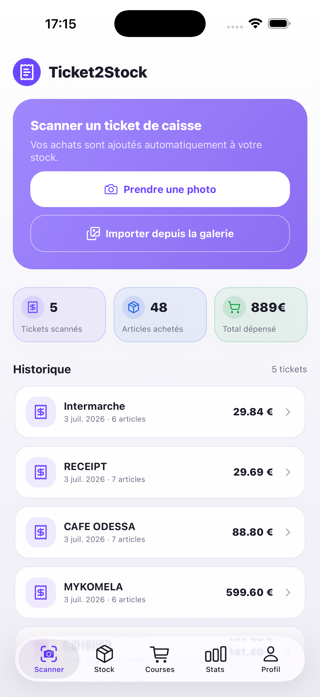
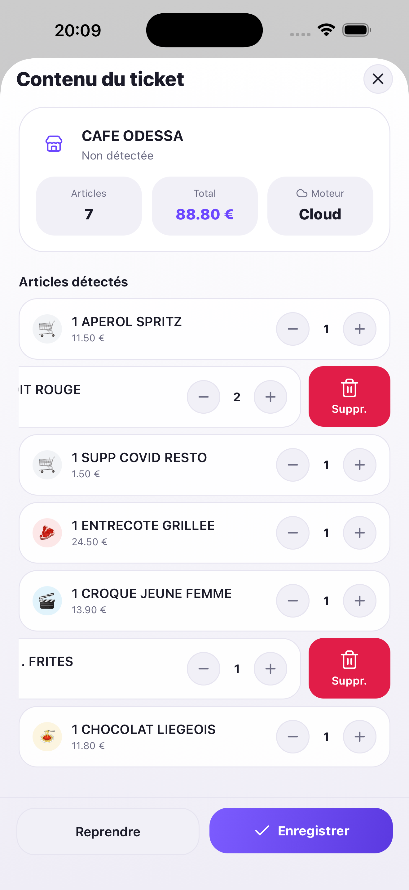
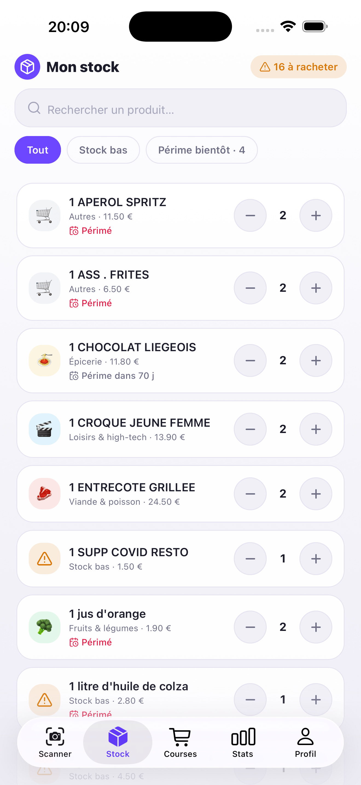
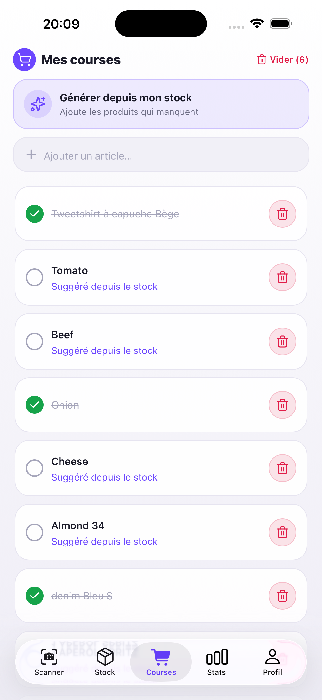
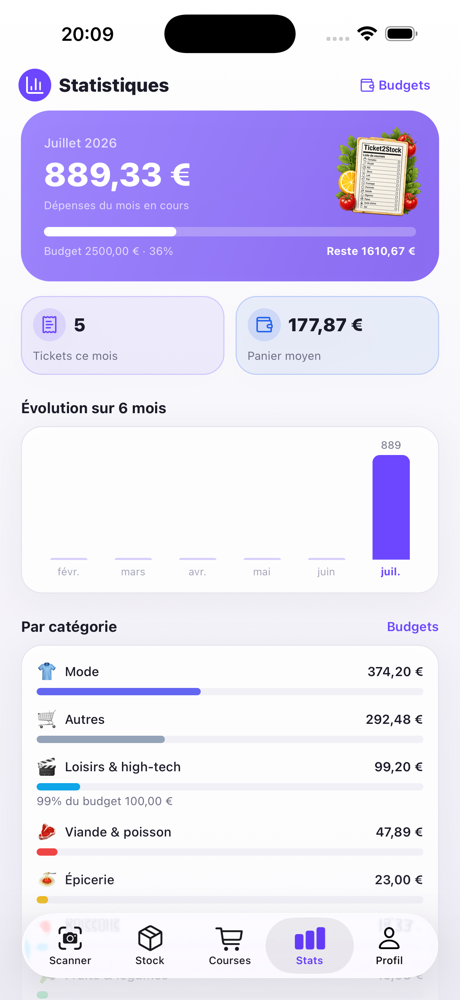
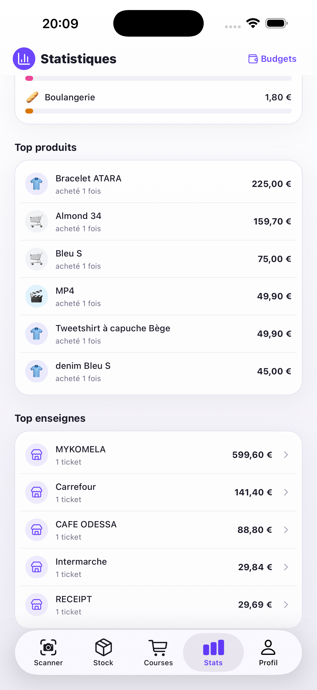
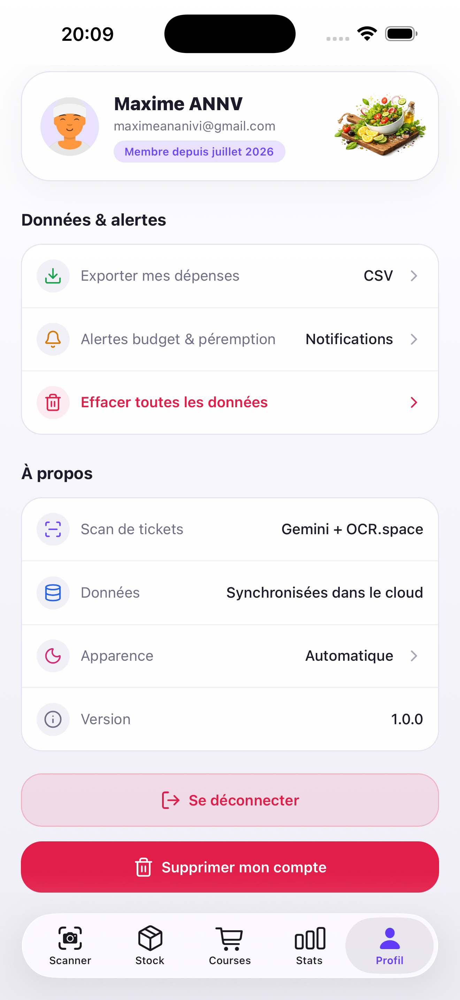
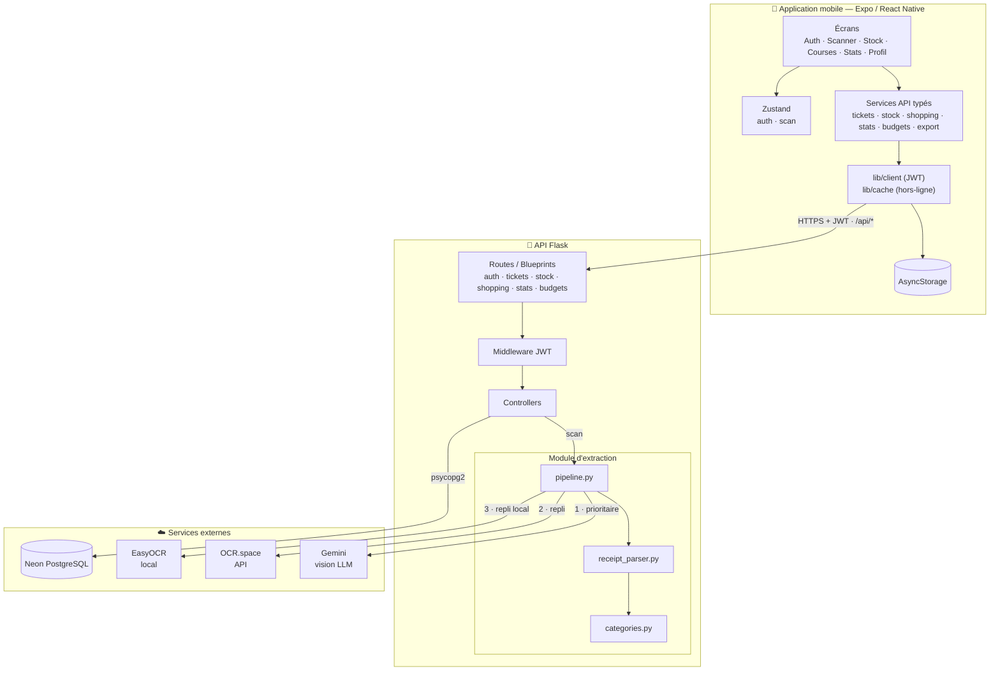

<div align="center">


# 🧾 Ticket2Stock
### Gestion de stock alimentaire par scan de tickets de caisse

<p align="center">
  <strong>Ticket2Stock</strong> transforme vos tickets de caisse en stock alimentaire :
  scannez un ticket, <strong>Gemini / OCR</strong> extrait automatiquement les articles,
  quantités et prix, votre stock se remplit tout seul, votre <strong>liste de courses</strong>
  se génère quand les produits manquent, et un <strong>tableau de bord</strong> analyse vos
  dépenses par catégorie et par budget.
</p>

<p align="center">
  <a href="https://github.com/Maxime015/Ticket2Stock/actions/workflows/ci.yml"></a>
  <a href="./LICENSE"></a>
  
  
  
  
</p>

</div>

---

## 📸 Screenshots

<div style="display: flex; justify-content: space-between; gap: 10px; flex-wrap: wrap;">

  
  
  

  
  
  

  
  
  

</div>

---

## 🚀 Fonctionnalités

- 📷 **Scan de tickets** — caméra ou galerie, extraction triple moteur (**Gemini** → **OCR.space** → **EasyOCR**), revue et édition avant enregistrement
- 📦 **Stock automatique** — chaque ticket alimente le stock, **15 catégories** auto-détectées, seuils de réapprovisionnement, suivi de **péremption**
- 🛒 **Liste de courses** — générée automatiquement depuis les articles sous leur seuil
- 📊 **Tableau de bord** — dépenses du mois, évolution sur 6 mois, répartition par catégorie, top produits / enseignes
- 💶 **Budgets mensuels** — global et/ou par catégorie, alertes de dépassement
- 🔔 **Notifications locales** — rappels de péremption (J-2, jour J) et alertes budget (90 % / 100 %)
- 📤 **Export CSV** — toutes les dépenses, prêt pour Excel FR
- 🔐 **Auth JWT** — BCrypt, rate-limiting · 🌙 **Thème clair / sombre** · 📶 **Cache hors-ligne** (lecture)

---

## 🏗️ Architecture


```mermaid
flowchart TD
    subgraph MOBILE["📱 Application mobile — Expo / React Native"]
        UI["Écrans<br/>Auth · Scanner · Stock · Courses · Stats · Profil"]
        SVC["Services API typés<br/>tickets · stock · shopping · stats · budgets · export"]
        LIB["lib/client (JWT)<br/>lib/cache (hors-ligne)"]
        STORE["Zustand<br/>auth · scan"]
        ASTORE[("AsyncStorage")]
        UI --> SVC --> LIB
        UI --> STORE
        LIB --> ASTORE
    end

    subgraph BACKEND["🐍 API Flask"]
        ROUTES["Routes / Blueprints<br/>auth · tickets · stock · shopping · stats · budgets"]
        MW["Middleware JWT"]
        CTRL["Controllers"]
        subgraph OCRMOD["Module d'extraction"]
            PIPE["pipeline.py"]
            PARSER["receipt_parser.py"]
            CATS["categories.py"]
            PIPE --> PARSER --> CATS
        end
        ROUTES --> MW --> CTRL
        CTRL -->|"scan"| PIPE
    end

    subgraph EXT["☁️ Services externes"]
        GEMINI["Gemini<br/>vision LLM"]
        OCRSPACE["OCR.space<br/>API"]
        EASY["EasyOCR<br/>local"]
        DB[("Neon PostgreSQL")]
    end

    LIB -->|"HTTPS + JWT · /api/*"| ROUTES
    PIPE -->|"1 · prioritaire"| GEMINI
    PIPE -->|"2 · repli"| OCRSPACE
    PIPE -->|"3 · repli local"| EASY
    CTRL -->|"psycopg2"| DB
```

Le projet est un monorepo à deux parties, chacune avec sa documentation détaillée :

| Dossier | Rôle | Documentation |
|---------|------|---------------|
| [`backend/`](./backend) | API Flask — auth JWT, extraction Gemini/OCR, stock, budgets, stats, PostgreSQL | [README backend](./backend/README.md) |
| [`mobile/`](./mobile) | Application Expo / React Native — écrans, services API, cache hors-ligne, notifications | [README mobile](./mobile/README.md) |

---

## ⚡ Démarrage rapide

**Prérequis :** Node.js ≥ 18, Python ≥ 3.10, une base PostgreSQL ([Neon](https://neon.tech)), une clé [Gemini](https://aistudio.google.com/apikey) et une clé [OCR.space](https://ocr.space/ocrapi) (gratuites), l'app [Expo Go](https://expo.dev/go) ou un simulateur.

```bash
# 1. Backend — API Flask sur :8080
cd backend
python -m venv venv && source venv/bin/activate
pip install -r requirements.txt
# créez backend/.env → voir le README backend
python app.py

# 2. Mobile — application Expo
cd mobile
npm install
npx expo start        # scannez le QR code avec Expo Go
```

> 🔌 En développement, l'app mobile détecte automatiquement l'IP de la machine qui sert le
> bundle Expo pour joindre l'API sur le port 8080 — aucune config à changer pour tester
> sur un téléphone physique.

La configuration détaillée (`.env`, clés API, tests du parseur, endpoints) est dans le
[README backend](./backend/README.md) ; le guide de l'application (écrans, structure,
cache hors-ligne) est dans le [README mobile](./mobile/README.md).

---

## 📜 Licence

Ce projet est sous licence **MIT**.
